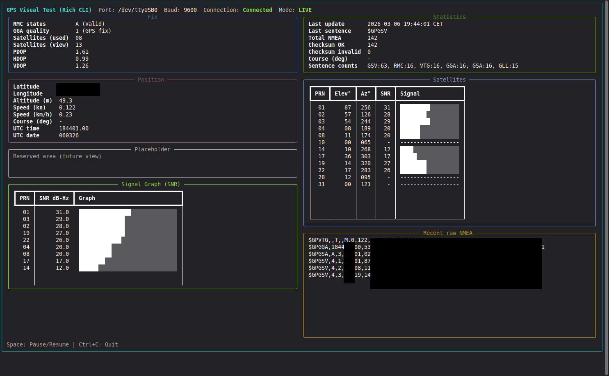

# ESP-SATDUMP

GPS satellite tracker firmware for ESP32 with a 4" TFT display.

> [!IMPORTANT]
> This is a **development version**. The codebase is subject to frequent and
> significant changes. Stable versions will be provided as packages later
> via [Milestones](../../milestones).

## Table of Contents

- [Overview](#overview)
- [Hardware](#hardware)
- [Firmware Pages](#firmware-pages)
- [Flashing](#flashing)
- [TFT_eSPI Setup](#tft_espi-setup)
- [Required Libraries](#required-libraries)
- [CLI GPS Visual Tool](#cli-gps-visual-tool)
- [Project Structure](#project-structure)
- [Serial Output](#serial-output)
- [Documentation Index](#documentation-index)
- [License](#license)

## Overview

ESP-SATDUMP reads NMEA data from a u-blox GPS module and renders multiple
satellite/fix views on an ST7796S TFT display.

## Hardware

| Component | Part |
|-----------|------|
| MCU       | ESP32 |
| Display   | LAFVIN 4.0" ST7796S TFT 480x320 (SPI) |
| GPS       | u-blox NEO-6M (UART2) |
| Encoder   | KY-040 rotary encoder |

Wiring reference: [`docs/pinout.md`](docs/pinout.md)

## Firmware Pages

| # | Name | Description |
|---|------|-------------|
| 1 | Sky View | Polar satellite plot (azimuth / elevation) |
| 2 | Signals | SNR bar chart per satellite |
| 3 | Fix Info | Latitude / longitude / altitude / speed / time |
| 4 | NMEA Raw | Scrolling raw NMEA sentence stream |

Encoder navigation:
- Clockwise: next page
- Counter-clockwise: previous page

## Flashing

```bash
# Auto-detect serial port and flash
./flash.sh

# Specify port explicitly
./flash.sh /dev/ttyUSB0
```

Requires [arduino-cli](https://arduino.github.io/arduino-cli/) and the
`esp32:esp32` board package.

## TFT_eSPI Setup

Copy `firmware/ESP_SATDUMP/User_Setup.h` into your TFT_eSPI library folder
(replacing the active setup), or configure `User_Setup_Select.h` to point to
that file.

## Required Libraries

```bash
arduino-cli lib install "TFT_eSPI"
```

## CLI GPS Visual Tool

A Rich-based live terminal dashboard is available for serial GPS debugging.



- Tool starter: [`tools/run_gps_visual_test.sh`](tools/run_gps_visual_test.sh)

- Full tool documentation: [`docs/gps_visual_cli.md`](docs/gps_visual_cli.md)

## Project Structure

```text
ESP-SATDUMP/
├── firmware/
│   └── ESP_SATDUMP/           # Arduino sketch and source files
├── tools/
│   ├── run_gps_visual_test.sh # GPS visual tool launcher
│   └── gps_visual_test.py     # Rich CLI GPS dashboard
├── docs/
│   ├── architecture.md        # High-level architecture
│   ├── gps_module.md          # GPS module notes
│   ├── pages.md               # Firmware page behavior
│   ├── pinout.md              # Wiring details
│   └── gps_visual_cli.md      # GPS visual tool documentation
├── flash.sh                   # Build + upload helper
├── monitorv2.sh               # Serial monitor helper
├── HARDWARE_PINOUT_EN.md      # Alternate pinout reference
└── Display_Pinout.txt         # Pinout notes
```

## Serial Output

After boot, firmware prints `[ESP-SATDUMP] boot` at `115200` baud and then
forwards GPS debug output.

Use `monitorv2.sh` or any serial terminal at `115200`.

## Documentation Index

- [Architecture](docs/architecture.md)
- [Pinout](docs/pinout.md)
- [GPS Module](docs/gps_module.md)
- [Pages](docs/pages.md)
- [GPS Visual CLI Tool](docs/gps_visual_cli.md)

## License

This project is licensed under the MIT License - see the [LICENSE](LICENSE) file for details.
